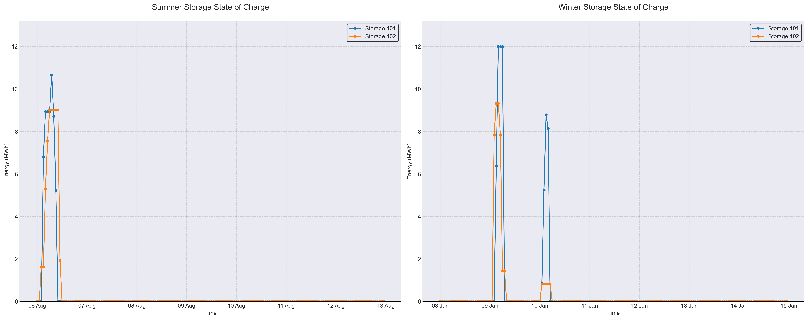

# Scenario Analysis Report: scenario_4
Generated on: 2025-02-15 10:51:43

## Overview

## Financial Analysis
| Metric | Value |
|--------|--------|
| Initial Investment | CHF 36,672,740 |
| Annual Operating Cost | CHF 1,482,721 |
| NPV (10 years) | CHF -72,719,083 |
| NPV (20 years) | CHF -93,787,246 |
| NPV (30 years) | CHF -102,634,744 |

## Generation Analysis

### Annual Generation by Asset Type
| Asset Type | Generation (MWh) |
|------------|-----------------|
| nuclear | 296'544 |
| battery1 | -8 |
| wind | 86'183 |
| battery2 | -5 |

### Generation Costs
| Asset Type | Cost (CHF) |
|------------|------------|
| cost_nuclear | 1'482'719 |

## Storage State of Charge

## AI Critical Analysis
## Critical Analysis of Scenario 4: Nominal

### Economic Efficiency
The economic efficiency of the generation mix in Scenario 4 appears to be skewed due to the overwhelming reliance on nuclear power, which accounted for nearly all generation (approx. 296,544 MW) and incurred high costs (approximately $1,482,720). The absence of operational solar, gas, and limited battery generation contributes to a lack of diversity and could elevate risks associated with fluctuations in nuclear output.

### System Composition Strengths/Weaknesses
The strengths of this scenario lie in the high capacity factor of nuclear (0.042), indicating consistent output. However, weaknesses include reliance on nuclear without complementary renewable sources or storage solutions to moderate demand variability. Wind generation shows a significant capacity factor (1.254), but underutilization hampers overall performance. The negative values for battery systems further highlight inefficiencies in energy storage management.

### Key Recommendations for Improvement
To enhance economic efficiency and system reliability, it is essential to:

1. Integrate solar energy generation to utilize renewable resources effectively, particularly during peak demand hours.
2. Invest in battery storage solutions to optimize energy dispatchability and manage excess generation, aiding in load balance.
3. Diversify the energy mix by introducing gas or additional renewable technologies to mitigate risks associated with dependence on a single source.

Implementing these strategies could significantly improve both efficiency and resilience of the energy system.

---
